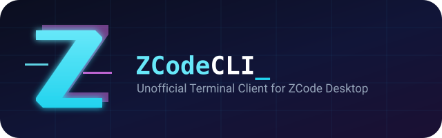
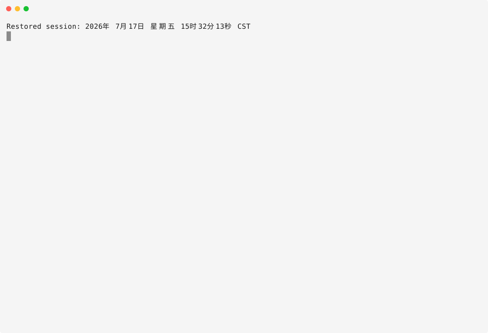

# ZCode CLI

<div align="center">



[](./LICENSE.md)
[](./CHANGELOG.md)
[]()

English | [简体中文](README_cn.md) | [繁體中文](README_zh_tw.md)

</div>

Unofficial terminal client for the official agent runtime shipped with ZCode Desktop.

The project extracts the upstream `resources/glm` runtime, injects a local
`@zcode/tui` implementation based on
[`@earendil-works/pi-tui`](https://github.com/earendil-works/pi/tree/main/packages/tui),
and launches it as a Node.js child process that directly inherits the user's
terminal.

This project is not affiliated with or endorsed by Z.ai. ZCode and its bundled
runtime remain subject to their upstream terms. Confirm that you are allowed to
redistribute the extracted runtime before publishing a release.



## Quick start

```bash
npm install -g https://github.com/xhqing/zcode-cli/releases/latest/download/zcode-cli-3.8.1-17.tgz
zcode
```

On first launch, ZCode creates `~/.zcode/cli/config.json` (or
`%USERPROFILE%\.zcode\cli\config.json` on Windows) with credential-free
defaults and opens a setup wizard in the TUI. It guides you through the three
model-access paths in [Configuration](./docs/CONFIGURATION.md), and when the
ZCode desktop app is installed it can import the desktop provider settings
(credentials stay behind a fresh sign-in, like a browser profile import).
Reopen it anytime with `/setup`; press Esc to skip.

## Table of contents

- [Quick start](#quick-start)
- [Install and update](#install-and-update)
- [Usage stats](#usage-stats)
- [Architecture](#architecture)
- [Features](#features)
- [Workspace integration](#workspace-integration)
- [Plugin management](#plugin-management)
- [Requirements](#requirements)
- [Configuration](#configuration)
- [Local development](#local-development)
- [Contributing](#contributing)
- [License & Attribution](#license--attribution)

## Install and update

```bash
npm install -g https://github.com/xhqing/zcode-cli/releases/latest/download/zcode-cli-3.8.1-17.tgz
# or
bun add -g https://github.com/xhqing/zcode-cli/releases/latest/download/zcode-cli-3.8.1-17.tgz
```

GitHub Releases are the only distribution channel; the project does not
publish to npm. The package installs as `zcode-cli` and the command is
`zcode`.

To upgrade an existing installation, run:

```bash
zcode --update
```

The command resolves the newest release from GitHub Releases (via the `gh`
CLI), downloads the release tarball asset, and reinstalls it globally.
GitHub Releases are the only update channel — every release carries the
`zcode-cli-<version>.tgz` asset that this command installs.

Interactive startup checks the latest GitHub Release at most once every 20
hours per installed version and shows a cached newer version as a
non-blocking update card with the exact update command and release-notes
link. CI environments skip the check automatically. Set
`ZCODE_DISABLE_UPDATE_CHECK=1` or `NO_UPDATE_NOTIFIER=1` to disable it.

A normal installation requires only Node.js and has no native PTY addon or
postinstall build step.

## Usage stats

```bash
zcode stats          # human-readable report
zcode stats --json   # machine-readable JSON
```

The ZCode runtime records every model request in a local SQLite database
(`~/.zcode/cli/db/db.sqlite`). `zcode stats` aggregates that history **per
provider** (one section per provider entry in `~/.zcode/cli/config.json`,
with the API key masked to its first and last four characters). Each section
lists request/error counts, **input tokens, cache-hit tokens with hit rate,
and output tokens**, plus estimated **credit consumption split into input /
cache / output buckets** using the official GLM Coding Plan rates (credits =
tokens × rate ÷ 10000; off-peak hours deduct at 50%). Models without a
published rate table are skipped and flagged. A final line sums all
providers.

zcode-cli sends requests through the official ZCode runtime (the request
carries `User-Agent: ZCode/<version>`), so vendor promotions that apply to
ZCode apply here too. When the BigModel OAuth token from `zcode login` is
present, `zcode stats` queries the vendor monitor API (the same one the ZCode
desktop usage page uses) and appends a **real server-side spend report** —
actual deducted credits per model including all promotions and off-peak
discounts, split into input / cache / output buckets. No token or request
failure simply omits the section and keeps the local estimate.

## Architecture

```text
Node.js launcher (config / login / version metadata)
  └─ inherited stdin / stdout / stderr
      └─ official zcode.cjs agent runtime
          └─ local @zcode/tui adapter
              └─ @earendil-works/pi-tui
```

The official agent, model, session, tool, plugin, MCP, credential store and
provider-configuration logic remains in the extracted runtime. The local
package supplies the missing terminal interface and a narrow macOS callback
bridge for Z.AI's registered Desktop OAuth flow. Node.js starts the public
command and remains the compatibility host for the extracted upstream kernel.
The official runtime directly owns raw terminal mode, IME cursor placement and
resize handling; the launcher does not insert a second PTY or relay terminal
bytes.

## Features

**Editor and input.** pi-tui differential rendering with a CJK-aware
multi-line editor; slash-command, unified `@` workspace/Plugin references and
`$` Skill completion; persisted prompt history through ZCode's history API;
`--no-color` and `NO_COLOR` support.

**Streaming and conversation.** Streamed assistant text from official ZCode
session events; `/mode`, `/model`, `/resume`, `/plugins` and other upstream
slash commands; searchable model and reasoning-effort selectors, plus MCP and
workflow panels; status-bar-only Shift+Tab mode cycling
(`build` → `edit` → `yolo` → `plan`), Ctrl+N model and empty-prompt Tab effort
cycling; structured session-goal status in the right side of the turn footer;
animated active-turn timer with a static `ZCODE_TUI_REDUCED_MOTION=1`
fallback; responsive context-remaining and session-token metrics.

**Login and permissions.** `/login` setup choices with masked API-key entry,
redacted transcript/history and OAuth waiting state; suspended Z.AI browser
login with terminal restoration and an optional `ZCODE_TUI_LOGIN_CMD`
override; interactive tool-permission approval dialogs.

**Attachments and rich output.** Clipboard image attachments through Ctrl+V
or `/paste-image`, with a keyboard-selectable attachment row; compact tool
execution views with path, command, progress, result and image previews;
parent/child Agent tool trees with resumable subagent metadata and expandable
Prompt/Response details; syntax-highlighted Markdown code blocks with stable
streaming-block rendering; Pierre-style inline diffs with line numbers,
syntax highlighting, word-level changes and CJK wrapping; terminal-native
Mermaid previews with source fallback for unsupported or oversized diagrams.

**Inspection and navigation.** `/diff` browser for current Git changes and
per-turn file changes; `/context` prompt-composition, cache and context-usage
details; `/status` session, runtime, goal, MCP and workspace details;
`/activity` and a task center for background status, output, agent conversations
and recovery; searchable transcript navigation with per-block expansion,
selected-block copying and
`n`/`N` match traversal; persistent active-tool, background-task and open-plan
activity between the transcript and editor.

**Steering, rewind and notifications.** Active-turn steering, cancellation
and error reporting; double-Esc rewind with input-point selection and safe
conversation/workspace scopes; unfocused turn-completion notifications through
terminal-native OSC 9 or BEL, with optional desktop commands; `/copy`,
`/cls`, `/exit`, Ctrl+C and Ctrl+D handling with token usage and resume
guidance on exit.

## Workspace integration

### Referencing workspace files

Type `@` at the start of the prompt or after whitespace to open project file
completion. Continue typing a path, use Up/Down to choose a candidate, then
press Tab or Enter to insert it. Selecting a directory lets you continue with
the next path segment.

```text
Explain @README.md
Compare @src/index.ts with @"docs/design notes.md"
```

Suggestions come from the official ZCode runtime, stay inside the current
workspace and exclude common repository metadata and dependency directories.
Paths containing spaces are inserted in the quoted `@"..."` form.

### Referencing plugins

The same `@` picker includes enabled, unambiguous Plugins that expose at least
one Skill, connected MCP server or Subagent. Plugin rows are labelled with an
`@name` and their marketplace. Selecting one inserts the runtime's native
Markdown reference:

```text
Use [@browser-use](plugin://browser-use@zcode-plugins-official) to check this page
```

The terminal editor shows the Markdown source because it has no desktop-style
inline chips. The runtime resolves the link against the active session and
adds only that Plugin's live capabilities as metadata. A Plugin reference does
not install, enable, authorize or force the use of any capability. Disabled,
ambiguous or stale references are ignored by the runtime.

### Invoking skills

Type `$` at the start of the prompt or after whitespace to open the Skill
picker. Continue typing a name, use Up/Down to choose a candidate, then press
Tab or Enter to insert it.

```text
$audit review the current changes
Use $browser-use:control-browser to verify the page
```

The picker uses the official runtime's Skill catalog and inserts plugin Skills
with their qualified names. On submission, exact `$name` matches are converted
into a request that loads each selected Skill through the runtime's `Skill`
tool before carrying out the visible user request. Unknown `$` tokens remain
ordinary prompt text.

Use `@plugin` when the whole Plugin is relevant, including its MCP servers or
Subagents. Use `$plugin:skill` when one exact Skill must be loaded before the
task starts.

Skill and custom-command discovery also works outside the TUI through the
runtime's subcommands, with `--json` for scripts:

```bash
zcode skills list                 # every discovered skill, plugin-qualified
zcode skills inspect <name>       # full description, source path and metadata
zcode commands list               # discovered custom slash commands
zcode commands inspect <name>     # argument hints and resolved body
```

### Active-turn input

While a regular agent turn is running, press `Enter` to send the current text
as same-turn steering. Until the official runtime reaches a safe model-step
boundary, the steer stays in a waiting row next to the editor instead of being
shown as committed conversation history. Once the runtime confirms injection,
the message moves into the transcript at its actual position and uses the normal
user-message `›` prefix. The `↪` marker is reserved for the temporary waiting
row.

To keep a follow-up editable instead, press `Tab` while the editor contains
text and completion is closed. The input remains in the local next-turn queue.
Queued inputs start in FIFO order after the active turn completes normally.
With an empty editor, press `Alt+Up` or `Shift+Left` to move the most recently
queued input back into the editor. Accepted steers cannot be edited because
they have already been handed to the official runtime, even while the waiting
row is visible; use `Tab` when the text must remain changeable. A steer rejected
or discarded before injection returns to the editable next-turn queue.

### Image attachments

Press `Ctrl+V` or run `/paste-image` to attach an image from the clipboard.
Pending images appear above the editor as complete `[Image #N]` tokens.
Submitting a prompt moves those images into that user turn immediately, so they
are removed from the pending row and cannot leak into the next prompt.

Move the editor cursor to the start of its first line and press `Up`, or run
`/attachments`, to focus the attachment row. While it is focused:

- `Left`/`Right` selects an image;
- `Backspace` or `Delete` removes the selected image and renumbers the rest;
- `Down`, `Esc`, `Ctrl+C`, or `Enter` returns to the editor without changing its text.

Run `/attachments clear` to remove every pending image at once. `Ctrl+D`
retains its terminal-standard empty-editor exit and forward-delete behavior.

### Conversation rewind

With an empty editor and no active turn, press `Esc` twice within 800 ms to
open the conversation rewind picker. Choose the user input to return to, review
the available workspace checkpoints, then select one of the available scopes:

- **Conversation only** removes later conversation turns, keeps workspace
  files unchanged, and restores the selected input to the editor;
- **Conversation and workspace** also restores safe checkpointed file changes;
- **Workspace only** restores safe checkpointed files without changing the
  conversation.

The scope picker only offers workspace restoration when the official ZCode
runtime reports a complete safe checkpoint plan. Files changed externally are
not overwritten, and Bash or terminal file mutations are reported as ignored
because they do not have restorable ZCode checkpoints. Press `Esc` in the scope
picker to return to input selection, then `Esc` again to close rewind.

### TUI inspection and navigation

```text
/diff                         browse current and per-turn file changes
/context                      inspect context usage and source composition
/status                       inspect detailed runtime and session status
/activity                     inspect every active tool and open task
/tasks                        inspect and manage background tasks
/tasks message <id> <text>    send guidance to a running background agent
/tasks resume <id> [text]     resume a stopped or failed background agent
/tasks stop <id>              stop a running background task
/search <text>                search retained transcript blocks
/search next|prev|clear       navigate or close transcript search
/transcript latest            select the latest transcript block
/transcript next|prev|close   navigate or leave transcript selection
/copy                         copy the selected block, or the latest response
/cls                          clear the visible transcript only
```

`/cls` clears what the TUI displays without touching the session. The
runtime's own `/clear` is an alias of `/new` and starts a fresh session, so it
is forwarded to the runtime unchanged.

The task center keeps autonomous task output out of the foreground transcript.
The main conversation receives only compact completion, reply and failure
notices; select the task to inspect its output and task-scoped activity. Agent
tasks can receive messages while running, and the official runtime resumes a
terminal agent from its saved child session when messaged. Bash tasks expose a
reviewable rerun request because a stopped process cannot continue from an
execution checkpoint. Saved final task output remains available after a TUI
restart, with large files limited to their latest 64 KiB. Workflow tasks open
their existing run panel and controls.

Agent calls that finish within one second remain ordinary foreground tools so
their result can feed the current response directly. Longer Agent calls move to
the task center automatically, releasing the foreground turn while they keep
running. Set `subagents.autoBackgroundMs` to a different positive duration, or
to `0` to disable automatic backgrounding. An explicit
`run_in_background: true` still backgrounds an Agent immediately.

While the editor is empty, `Alt+Up` and `Alt+Down` navigate selected transcript
blocks. `Ctrl+O` expands only the selected/search-matched block; without a
selection it toggles all expandable content. During transcript search, `n` and
`N` move to the next and previous match. `Left`/`Right` (or `PageUp` and
`PageDown`) page through an oversized selected block without rendering the
entire message at once. `Esc` leaves search or transcript navigation.

## Plugin management

Built-in Plugins such as Browser Use, document skills and Skill Creator are
seeded by the official runtime. Existing installed-plugin commands continue to
use the runtime directly:

```bash
zcode plugins list --json
zcode plugins enable <plugin-id>
zcode plugins disable <plugin-id>
zcode plugins uninstall <plugin-id> --force
```

The Node.js launcher adds marketplace operations by calling the runtime's public
`app-server` protocol; it does not patch or reimplement the Plugin subsystem.
Run `zcode plugins --help` for the full command list. A typical third-party
installation is:

```bash
zcode plugins discover
zcode plugins marketplace add owner/repository --dry-run
zcode plugins marketplace add owner/repository
zcode plugins describe plugin-name@marketplace-name
zcode plugins install plugin-name@marketplace-name --dry-run
zcode plugins install plugin-name@marketplace-name
```

Marketplace addition and installation validate first, display the Plugin's
components and dependency closure, and ask for confirmation. Use `--yes` only
for intentional non-interactive execution, `--json` for structured output and
`--scope user|workspace` to choose installation scope. Marketplace Git access
behind a proxy uses `ZCODE_HTTP_PROXY`.

Plugins with configuration can load options from a JSON file without exposing
values in the process argument list:

```bash
zcode plugins configure plugin-name@marketplace-name \
  --options-file ./plugin-options.json --dry-run
zcode plugins configure plugin-name@marketplace-name \
  --options-file ./plugin-options.json
```

Keep files containing secrets private. Install, update, configure, enable and
disable changes apply to new sessions.

### Browser Use in the CLI

The launcher enables the CLI-managed headless Chromium backend by default for
TUI, `--prompt`, `--print` and `--target` sessions. This makes an enabled
`browser-use` Plugin usable from the normal `zcode` command without a separate
startup flag:

```bash
zcode
zcode --prompt \
  'Use $browser-use:control-browser to inspect https://example.com'
```

The explicit `--browser-use=headless` form remains supported, including with
`--browser-executable <path>` when Chromium needs to be selected manually.
The managed backend still requires a usable local Chrome/Chromium executable;
if automatic discovery fails, pass its absolute path with
`--browser-executable`.
The launcher never injects Browser Use into `plugins`, `skills`, `doctor`,
`app-server` or other management commands. Existing sessions must be restarted
before the backend becomes available.

The managed browser is an ephemeral headless context. It does not reuse the
ZCode Desktop in-app browser profile, cookies or login state, so public search
engines may close connections or request verification more often, especially
on VPN, proxy or shared egress IPs. `--browser-executable` only selects the
Chrome/Chromium binary; it does not make the browser headful or persistent.
For general fact finding, avoid forcing Browser Use when a search capability is
available. Use direct page URLs where possible, and use the Desktop in-app
browser for interactive login or verification flows.

## Requirements

- Node.js 22.19 or newer;
- macOS, Linux or Windows on x64 or ARM64.

Z.AI browser OAuth currently requires macOS because the registered provider
callback is `zcode://zai-auth/callback`; API-key and custom-provider access work
on every supported platform.

Set `ZCODE_NODE=/absolute/path/to/node` when the desired Node.js executable is
not available on `PATH`.

## Configuration

ZCode reads configuration from `~/.zcode/cli/config.json` (or
`%USERPROFILE%\.zcode\cli\config.json` on Windows), with project-level
overrides from `zcode.json` or `.zcode/config.json` in the working directory.
Existing files are never replaced.

Three model-access paths are supported: Z.AI OAuth (macOS only), Z.AI/BigModel
Coding Plan API key, or a direct API key with a custom provider. For detailed
setup steps, retries/timeouts, theme, and turn-completion notifications, see
[Configuration](./docs/CONFIGURATION.md).

As a flat-file alternative, copy the commented `.env.example` template to
`~/.zcode/cli/.env` and fill in your API key and model IDs: on every start
zcode syncs that file into config.json before the runtime boots, no login or
JSON editing required. Backup keys go into numbered variables
(`ZCODE_API_KEY_2`, `ZCODE_API_KEY_3`, ... — one key per variable): with more
than one key zcode runs a loopback failover proxy that
transparently retries each request with the next key when one is rejected
(401/403/429, 5xx, connection failures) — see
[Configuration](./docs/CONFIGURATION.md) for details.

## Local development

Install dependencies and start the client with live TypeScript and auto-sync
from the local ZCode Desktop installation:

```bash
bun install
bun run dev
```

Run all validation layers:

```bash
bun run typecheck
bun test
bun run check
bun run check:tui
```

For the OAuth path, release workflow details, CI, and the full development
guide, see [Development](./docs/DEVELOPMENT.md). For maintainer-only release
and publishing workflows, see [Releasing](./docs/RELEASING.md).

## Contributing

Issues and pull requests are welcome at
[github.com/xhqing/zcode-cli](https://github.com/xhqing/zcode-cli).
Please open an issue first to discuss substantial changes. See
[Development](./docs/DEVELOPMENT.md) for the local setup and validation
commands, and [Releasing](./docs/RELEASING.md) for the release flow.

## License & Attribution

This project is released under the [MIT License](./LICENSE.md).

- Copyright (c) 2026 All Contributors.
- Attribution: when you reuse or redistribute this project, please keep the copyright notice and license text, and credit the project by linking back to its repository.
- Project URL: https://github.com/xhqing/zcode-cli
